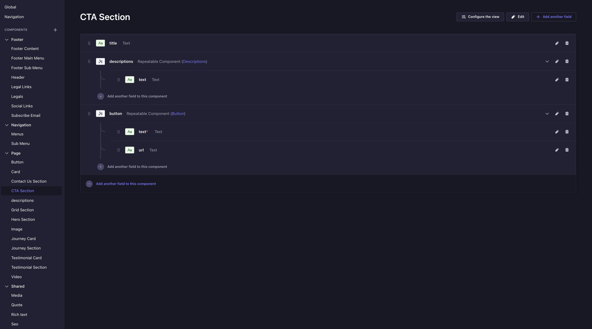
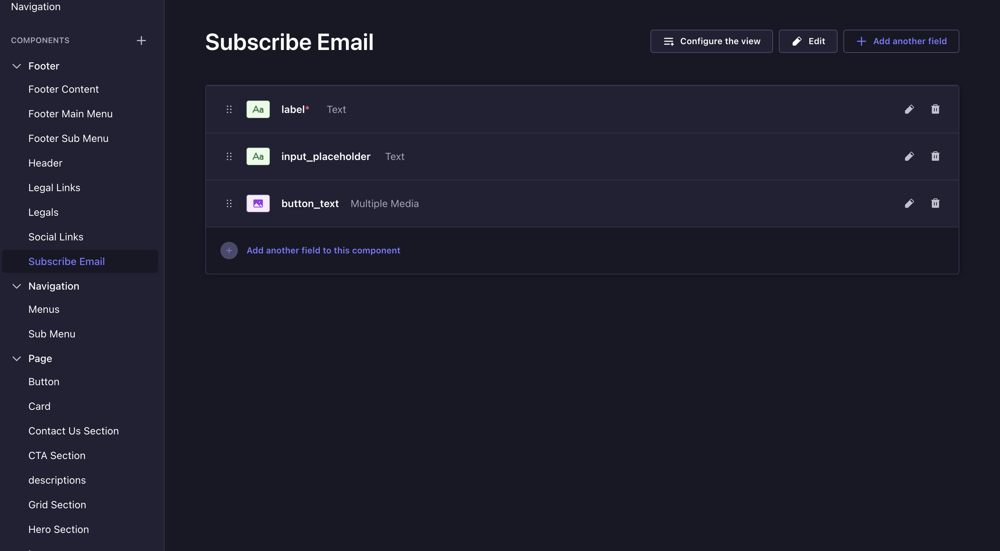

# Strapi Backend Assignment

This Strapi project was created to provide a flexible and scalable backend for a modern webpage, based on the provided UI layout. The content architecture is designed to be modular, allowing an editor to easily build and manage page content without needing a developer.

## Prerequisites and Installation

To run this project locally, you will need Node.js and npm (or yarn) installed on your machine.

1.  **Clone the repository:**

    ```bash
    git clone <your-repository-url>
    cd <your-project-folder>
    ```

2.  **Install dependencies:**

    ```bash
    # Using npm
    npm install


    ```

3.  **Run the project:**
    Start the Strapi development server.

    ```bash
    # Using npm
    npm run dev


    ```

The application will be running at `http://localhost:1337`.

## Accessing the Strapi Admin Panel

Once the project is running, you can access the admin panel to manage content.

1.  Navigate to `http://localhost:1337/admin`.
2.  The first time you run the project, Strapi will prompt you to create an administrator account. Please create your admin user.
3.  **Credentials:**
    - **URL:** `http://localhost:1337/admin`
    - **Username:** suraj.yadav@vedicrishiastro.com
    - **Password:** Suraj@123

## Content Model Strategy

The core strategy for building this backend was centered around creating a highly configurable page structure using Strapi's powerful features:

- **Single Types:** Used for unique, one-off pages like the "About" page. This ensures there's only one instance of this page to manage.

- **Components:** Created for every reusable piece of the UI (e.g., a button, an image with alt text, a card). This avoids repetition and keeps the design consistent.

- **Dynamic Zones:** Implemented on the main page type to allow content editors to add, mix, and reorder different content "sections" (like a Hero, a Grid, or a Testimonial section) to build a page dynamically.

- **Repeatable Components:** Used extensively within sections to allow for lists of items, such as navigation links, feature cards, or testimonials.

This component-based approach makes the content management system (CMS) extremely powerful and user-friendly.

---

## Content Type Builder

Below is a breakdown of all the Content Types and Components created for this project, along with screenshots from the Strapi admin panel.

### 1. Single Type: About Page

This is the main content type for building the page. It contains metadata and a Dynamic Zone field named `sections`, which is the key to the page's flexible structure.

**Fields:**

- `title`: The main title of the page.
- `page_slug`: The URL-friendly identifier for the page.
- `meta_title`: For SEO purposes.
- `meta_descriptions`: For SEO purposes.
- `sections`: A **Dynamic Zone** that allows the selection of various page components to build the page.


---

### 2. Components

Components are the reusable building blocks of the page. They are grouped here by their general purpose (e.g., Page Sections, Navigation, Footer).

#### Page Sections

These are the high-level components that can be added to the `sections` Dynamic Zone on the About page.

- **Hero Section**

  - _Purpose:_ The main banner section at the top of the page.
    

- **Journey Section**

  - _Purpose:_ To showcase a process or timeline in a card-based layout.
    

- **Grid Section**

  - _Purpose:_ A flexible grid to display features, team members, or other categorized content.
    

- **Testimonial Section**

  - _Purpose:_ To display customer or user testimonials in a slider or list.
    

- **CTA Section**
  - _Purpose:_ A "Call to Action" block to encourage user interaction, with a title, description, and button.
    

#### Navigation Components

These components are likely used within a "Global" or "Navigation" Collection Type to manage the website's main menu.

- **Menus**
  - _Purpose:_ Defines the structure for a navigation link, including support for nested sub-menus. The `has_submenu` boolean field can be used to conditionally show a dropdown on the frontend.
    

#### Footer Components

These components are likely used within a "Global" or "Footer" Collection Type to manage the website's footer content.

- **Legals**

  - _Purpose:_ Manages the copyright text and a repeatable list of legal links (e.g., Privacy Policy, Terms of Service).
    

- **Subscribe Email**
  - _Purpose:_ Defines the fields for a newsletter signup form in the footer.
    

---

## Postman Collection

To test the API endpoint for the "About" page, a Postman collection has been included in this project.

You can find the collection file inside the `/postman-collection` folder. Import this file into Postman to see the pre-configured request for fetching the page data. This will demonstrate how the structured content is delivered through the API.

---
